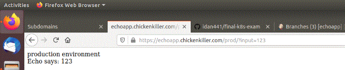

# Full CI/CD pipeline using the GitOps methodology running on Google Cloud
This project will show a full CI/CD pipeline for the echo application, using the GitOps methodology using Jenkins, Google cloud docker registry and Flux. 

GitOps is a way to do Kubernetes cluster management and application delivery. It works by using Git as a single source of truth for declarative infrastructure and applications. 

* Flux is a tool that automatically ensures that the state of your Kubernetes cluster matches the configuration you’ve supplied in Git. 
* Jenkins is a tool for making continuous integration. 
* Google Cloud is a set of computer infrastructures supplied by Google. In this project Google Cloud will supply - 
    * A docker container registry (GCR service) for holding the application images. 
    * Virtual machine which will run Jenkins. 
    * Kubernetes (in short k8s) cluster which will run the application online on the web. 

# The CI/CD pipeline for the echo application - 
Jenkins will do the continous ingegration (CI) , while FluxCD will do the continuous deployment (CD) . 

A general diagram of the pipeline - 
1. The programmer will do a push to the echo application GitHub repository. 
2. Every time a push is made, GitHub will trigger a webhook which in turn will make Jenkins work. 
3. Jenkins will build the application, by dockerizing it and pushing it to the Google Container Registry. (GCR, a docker container registry service by Google Cloud. ) 
4. FluxCD, which is installed on the Kubernetes (k8s) cluster will check every 5 minutes the GCR. 
5. FluxCD will do the development, by taking the image and installing in on the Kubernetes (k8s) cluster. Afterwards, it will update it's Git registry. ( Which will be used as a config repository. ) 

 

### Looking at the levels of repositories - 
The Git Ops scheme presented with the 2 repositories - a code repository used by the developers and a FluxCD repository which shows the current versions of the echo application images. These will be running in the Kubernetes cluster 
 

### Accessing the echo application - 
The echo application is having three environments - 
* Production - https://echoapp.chickenkiller.com/prod/
* Development - https://echoapp.chickenkiller.com/dev/
* Staging - https://echoapp.chickenkiller.com/staging/

The purpose of the echo application is to accept an input through GET and record it in a mongo database. ( example - https://echoapp.chickenkiller.com/prod/?input=123 )
* Both production and Staging environments record the inputs in mongo db. 
* The development environment is not storing the records in a database. 
* The setting of the application port, user of database, mongo db url etc.. are all done in through environmental variables. 

For this project there are GitHub repositories being used - 
* https://github.com/idan441/echoapp - which is the Git repository for the echo application project. It has 3 branches for the 3 environments. 
* https://github.com/idan441/echo_app_fluxcd - which is the Git repository used by FluxCD as a registry. 

All source files of this project can be found at this repository ( https://github.com/idan441/full_CI_CD_pipeline_using_FluxCD ) , including the source file of both former repositories. 

 

## The project's repository structure - 
The project repository structure includes three folder - 
1. echoapp - which includes the source files of the echo application and the branches of the three environments. The echo application was uploaded to another reository which will represent a development team Git repository. ( https://github.com/idan441/echoapp ) 
2. jenkins - which includes all Jenkins files and a README.md file with instructions on how to configure and re-install the Jenkins environment. 
3. kubernetes - which include all configuration files for the project's kubernetes files. Also included files of the FluxCD. There is an internal README.md file with more instructions and step-by-step guide on how to use, configure and re-install all kubernetes cluster. 
    * The FluxCD files and instructions are also found in this directory. The FluxCD repository is at https://github.com/idan441/echo_app_fluxcd 

Every directory is having a README.md file with more instructions and details. 

### prerequisites to use be able to configure the cluster from a remote computer - 
As this project is based on google cloud services, it is recommended to install the following softwares in order to be able to configure the kubernetes (k8s) cluster from your local machine. 

install kubectl + gcloud on your local machine. 
    * using gcloud you can enter you google credentials, which will allow you to connect to the gcloud console from you local terminal. 
    * kubectl will allow you to access the Kubernets (k8s in short) from you terminal. 

Further explanations on how to use these plugins are found inside the internal directories. 

# Jenkins VM - 
In this project, Jenkins will do all the continous integration (CI) of the pipeline. 

the Jenkins VM was created at google cloud. Its IP address is http://34.69.188.35/ , and use the login credentials which were set upon installation. 

* Jenkins is running as a docker container image on the local VM with port 8080 exposed as port 80 . 
* Jenkins is connected to GitHub and Google Container Registry via SSH private keys. There is no need for installing any special plugin for that. 

Jenkins will scan the echo application repository (https://github.com/idan441/echoapp ) every 10 minutes. If a new commit is found - then it will build a docker image of it and will upload it to the Google Container Registery (GCR) which is a docker registry service operated by Google cloud. (Like Dockerhub - but a one which can be privately used by the your organization, with premission system. ) 

A Jenkinsfile was attached to three branches of the application repository - development, environment and production. Jenkins scans the the repository with it's 3 branches every ten minutes. When a new commit is made, it will build the image and will upload it to Google Container Registry. (GCR) 

For further information about configuration and how to re-install and configure Jenkins, refer to the ./jenkins directory. ( ./jenkins/README.md file) 

#### Pictures of the Jenkin's "echo application" multi branch pipeline dashboard, and the Google Cloud Registry (GCR) with the uploaded pictures - 
 
 

# The echo application repository - ( The costumer application repository which is used by it's development team. ) 
The source files were copied to another repository in the address - https://github.com/idan441/echoapp 

Two branches were created - "dev" and "staging" , making a total of three branches: dev, staging and master. 

The source files for the echo application are in the "echoapp" directory. 

In order for Jenkins to be able to access GitHub they need to be connceted. SSH key was used for that. the SSH keys were created on the Jenkins VM and can be found in the root directory. The public key used to make a deploy key at GitHub allowing the connection to be made. ( For instruction about installing the keys please see ./jenkins/README.md . ) 

# The Kubernetes (k8s) cluster - 
Kubernetes (K8s) is an open-source system for automating deployment, scaling, and management of containerized applications. It groups containers that make up an application into logical units for easy management and discovery. 

You can access the different environments through the following domain addresses - 
* Product environment - https://echoapp.chickenkiller.com/prod/
* Staging environment - https://echoapp.chickenkiller.com/dev/
* Development environment - https://echoapp.chickenkiller.com/staging/
* The address https://echoapp.chickenkiller.com is not refering any service - please use the full path as listed! 
* The domain is actually a sub-domain supplied free by the open-source service freedns, which is available through the address - https://freedns.afraid.org 

The Kubernetes external IP address is - 34.66.227.145 ( Cannot be accessed through web, as the nginx-ingress service is configured to allow access only through the domain addresses. ) 
* The external IP address is the IP address which exposes the k8s cluster to the web. This IP addresss is refering to an internal nginx server installed on the Kubernetes cluster. 
* Inside the cluster, there is an internal network with internal IP addresses. This IP addresses are accessed only from within the Kubernetes cluster. 

## How to use, install and configure the Kubernetes cluster - 
All configurations, further exaplnations and useful commands can be found at the "kubernetes" directory in the file README.md 

Most of the commands for installing and configuring the kubernetes cluster are at the automatic installation script "install.sh" located at "./kubernetes/configure/install.sh" . 
* Please note that some of the configurations (such as ssh keys) need to be done manually, refer to the README.md file under the "kubernetes" directory. 

# Logging and monitoring - using Kibana, Prometheus and Grafana - 
Logging can be analyzed and viewed using Kibana. 
Monitoring - with Prometheus and Grafana. 

For more information on how to access these see the README.md file at the Kuberenets directory. ( at the path ./kubernetes/README.md ) 

