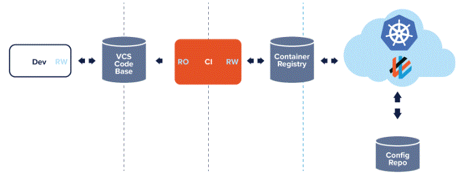
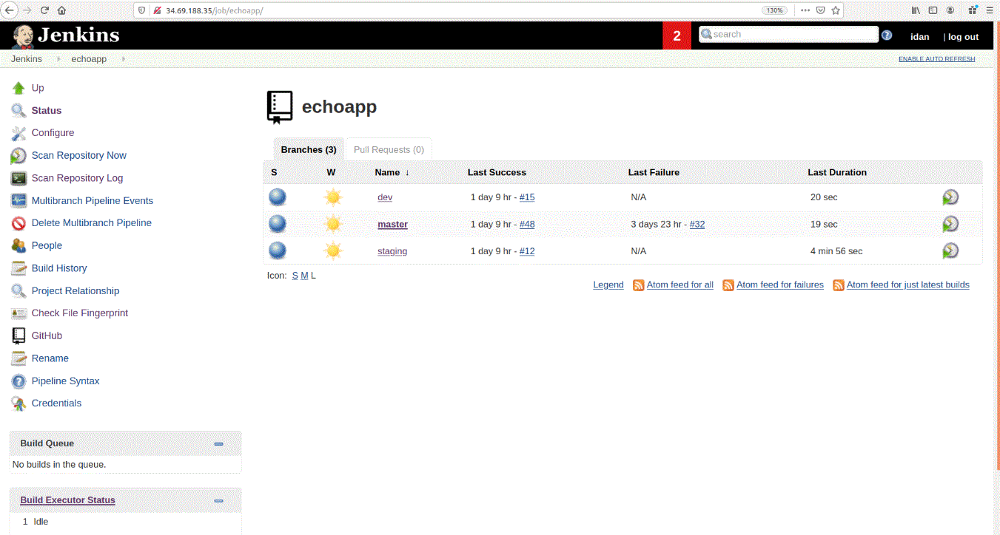

# Jenkins VM used for the continous integration (CI) of the pipeline 
For this project, Jenkins is installed on a VM at G cloud. 
Jenkins will be used for the continous intergration (CI) part of the pipeline for the echo application. 
1. It will scan periodically the GitHub repository containing the code of the echo application. 
2. If there are new commits - it will build them by dockerizing them. 
3. It will deploy the final images to Google Container Registry (GCR) which is basically a docker registry supplied by Google cloud. 

From this point - the continous deployment (CD) part of the pipeline will be done by FluxCD. Please refer to ../kubernetes/README.md or ../kubernetes/flux_repo/README.md for more details. 

 


## The virtual machine was configured as follow: 

0. All files used for the configuration at in the sources directory and were copied to the root user directory using scp (ssh copy) command. 
1. install docker. ( run sh script found in the sources file. ) 
2. install docker compose. ( run sh script found in the sources file. ) 
2. copied the docker-compose.yaml in the source directory to the VM. 
3. running the docker-compose.yaml file on the VM. This file will run a Jenkins image. 
    Command - ```sudo docker-compose up -d``` 
    The docker-compose.yaml is set to always run on restart, in case the server will fall... 

4. Following these configuration, the Jenkins was installed manually. 

5. An ssh connection between GitHub and Jenkins was made, by creating a pair of keys on the VM, and implemeting a credential on Jenkins and a deploy key on Github. ( See the section 'Setting a connection between Jenkins and GitHub" below for further details. ) 

6. No extra plugins were installed on Jenkins. Just the basic suggested plugins at the setup menu! 

7. The google access credentials were set on Jenkins, the same way as the ssh keys. ( see below. ) 
    * When creating teh credentials choose "google authentication" instead. 
    * The credentials were created through IAM and uniquely for the use of Jenkins. 
    * Due to secrecy, I will not mention the credentials here. 
    * Now go to Jenkins and add the credentials. 
    * In Jenkins - choose "credentials" on the side menu and choose to create a new global credential. Choose the "secret file" type and make the credentials. 
    * For making the credential upload the Key file downloaded from Google IAM. In the user id **MAKE SURE TO WRITE** - "Google-GCR-auth" . 
    * In the Jenkinsfile, I require the credentials with the ID Google-GCR-auth , therefore make sure to put this ID - or else you will have to edit the Jenkinsfile instead. 


# How to acces Jenkins: 
1. Jenkkins as a web-interface on port 8080 . I binded this port to 80 , whilst allowing http connection to the VM . (This network setting is a default on G cloud. ) 
2. enter the IP address of the VM under port 8080 . 
    IP address - 34.69.188.35 
    Hyper link - http://34.69.188.35:80

3. in the login screen - enter the username and password defined at the installation. 

    When installating JEnkins, you will be supplied with an initial admin password. Every time you re-install Jenkins it will output a new password for installation at the terminal. So make sure to watch for it when running the Jenkins dockerfile for the first time. In case you didn't - you will have to delete the volume defined at the docker-compose.yaml file and to start the installation again. 

4. All Jenkins data is volume mounted to the local VM , so in case of restart - no lost of information will happen. 
    In case you need to access this information or you would like to back it - you may find it in the path - "/var/jenkins_home" - on the local VM storage disk.  


# Giving names to docker images at Google Container Registry (GCR) - 
All images in Google Container Registry (GCR) must follow the convention - 
[HOSTNAME]/[PROJECT-ID]/[IMAGE]
The Jenkinsfile will upload the images according to that convention. The three fields are set in the file ./jenkins_scripts/build-image.sh, which can be found in the **echo repository** at every branch. 
Currently I set the following definitions - 
* HOSTNAME = us.gcr.io - A data center in the Unites states where the images will be stored at. 
* PROJECT-ID = coastal-range-267909 - this is the project ID as I took from the Google Cloud console. 
* IMAGE = echo - this is the application's name. 
You may change this fields as desired. ( For example when changing the project name, when wishing to store the files in a different host or when making a new project. ) After editing and changing the build-image.sh shell script - make sure to update it at the newest comment on EVERY branch in the Echo application repository! 
* REMEMBER - WHEN EDITING A JENKINSFILE IT WILL BE EDITED JUST ON THE BRANCH! YOU MUST MANUALLY COPY IT TO THE OTHER BRANCHES! 

## The Jenkinsfile - 
In order to make a branch to be used by Jenkin's Multi-branch pipeline - you need to do the following - 
0. Configure the 3 fields at the Jenkinsfile. 
1. Copy the Jenkinsfile to the root directory of the branch. ( This file will be located when Jenkins will scan the GitHub repository. ) 
2. Copy the jenkins_scripts directory - and place it under the root directory. The directory includes 3 files. ( These files will be used by the Jenkinsfile. ) 
3. Remember - these files need to be on every branch! When updating the Jenkinsfile and ocmmiting the chnages - the commit happens just on the local branch. You need to copy the updated file to all the branches! 

* I attached a copy of these files under the directory "backup-jenkinsfile" , but remember they need to be on the application repository! ( At https://github.com/idan441/echoapp . ) 

 


# Setting a connection between Jenkins and GitHub - ( assuming you need to remake the VM , etc... ) 
The echo application is located in an independent repository at - https://github.com/idan441/echoapp 
In order for Jenkins to connect to the GitHub repository - an SSH tunnel was created. 
A set of two RSA keys was created on the local VM itself. The private key was added to the ssh diretory at the VM, while the public key was set on GitHub as a deploy key. ( A key which allows to acces the echoapp repository. ) 

Due to secrecy and safety, obviously, I didn't specify the keys here. In case you need to replace keys, here I attach the commands and instructions - 
* On the VM - 
     cd to the .ssh repository on the root directory. 
     enter the following commands in order to create a pair of keys - 
     create a pair of keys - ```ssh-keygen -t rsa -b 4096 -C "idan441@gmail.com``` ( You might want to change the mail. ) 
     add the private key - ``` eval "$(ssh-agent -s)" && ssh-add ~/.ssh/id_rsa ``` ( assuming the private key file name is "id_rsa" . ) 
* On GitHub - 
     enter the repository - https://github.com/idan441/echoapp
     click the "configuration" button at the top menu. 
     click on "deploy key" button at the side menu. 
     choose to add a new deploy key - and put the content of the public key creat on the VM machine. ( you can use "cat" function on the local machine to see the content of the public key. ) 
* On Jenkins - 
     enter the credentials menu - > glbal keys -> add a credentials
     choose to use SSH key, give it a name and an id. 
     put the content of the private key. 
* Now, assuming you made a new key, you need to set the new key in the branch pipelines configuration, to be able to use them. 


# Authenticating to GCR - ( Google Container Registry. ) 
In order to push the echo application images to GCR, there needs to be an authentication in front of Google Cloud. 
The authentication credentials were created, and added to Jenkins' credentials. The way they were set up is just like how I set up the credentials for GitHub at the above scope. 

A small note - there is no need for any installation of plugins in order to connect to Google cloud from the pipeline. Instead, the g-cloud was pre-installed on the Jenkins image. ( The intallation command are mentioned in the Jenkins dockerfile at ./jenkins/sorces/Dockerfile . ) 

When I made this project, I made an AMI user named "jenkins" , with the assigned email address - "jenkins@coastal-range-267909.iam.gserviceaccount.com" . I called the Jenkin's credentials with the name "Google-GCR-auth" . The user name doesn't matter, what matter is the credentials name on Jenkins software - because its set in the Jenkinsfile itself! 


## How to set gcloud credentials on Jenkins - 
If by any case, you need to re-make the credentials and the connection between Jenkins and GCR - use the following orders: 
1. Enter to the Google Cloud service and choose the echo application project. 
2. Enter to the IAM service. ( Identity Authentication Management, type it in the search. ) 
3. Create authentication methods with the following premissions: 
    * Choose "Create service account" which are for use of SERVICE TO SERVICE. 
    * Choose a name for the account. 
    * Then you will be asked to assign a role for the account. Choose: Storage -> Storage admin . This will give the createad account full premissions on the GCR. 
    * Then choose to assign a private key for acces. Download the key! AND KEEP IT SECRET! 
4. In Jenkins - 
    * choose "credentials" on the side menu and choose to create a new global credential. Choose the "secret file" type and make the credentials. 
    * For making the credential upload the Key file downloaded from Google IAM. In the user id MAKE SURE TO WRITE - "Google-GCR-auth" . 
    * In the Jenkinsfile, I require the credentials with the ID Google-GCR-auth , therefore make sure to put this ID - or else you will have to edit the Jenkinsfile instead. 

4. Checkpoint - Try to build in a pipeline. If you configured the credentials right, you can see on the build's log the output - ``` Activated service account credentials for: [jenkins@coastal-range-267909.iam.gserviceaccount.com] ``` ( the user address will be different if you have made different user at AIM . ) 

5. If everythings is set right, you can see new images pushed on GCR. 

 


# Useful documentation - 
* Using docker-compose - https://docs.docker.com/compose/gettingstarted/ 
* Installing docker - https://docs.docker.com/compose/install/ 
* Installing docker on ubuntu 18.04 - https://www.digitalocean.com/community/tutorials/ how-to-install-and-use-docker-on-ubuntu-18-04 (until step 2 ) 

* How to generate an ssh-key - https://help.github.com/en/github/authenticating-to-github/ 
* and also generating-a-new-ssh-key-and-adding-it-to-the-ssh-agent

* Add a trigget Github trigger to contact Jenkins - 

* How to use google authentication with Jenkins - ( I did lots of modification bymyself, what matter in this part of the tutorial is just how to create the user at Google AIM . ) 
    https://medium.com/google-cloud/how-to-push-docker-image-to-google-container-registry-gcr-through-jenkins-job-52b9d5ce9f7f 
* The Google Cloud IAM premissions needed to push image to GCR - The official Google Cloud documentation - https://cloud.google.com/container-registry/docs/access-control#permissions_and_roles 


