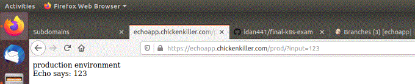
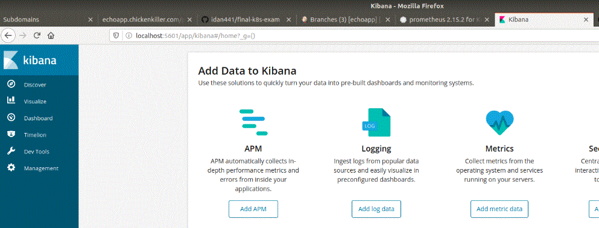

# Kubernetes cluster for the echo application project

Kubernetes (K8s) is an open-source system for automating deployment, scaling, and management of containerized applications. 
In this project, Kubernetes will be used as an environment to run the echo application. Kubernetes will run 3 docker containers of the echo application in production, development and staging mode. 


You can access the different environments through the following domain addresses - 
* Product environment - https://echoapp.chickenkiller.com/prod/
* Staging environment - https://echoapp.chickenkiller.com/dev/
* Development environment - https://echoapp.chickenkiller.com/staging/
* The address https://echoapp.chickenkiller.com is not refering any service - please use the full path as listed! 

In generally - the project includes the k8s cluster itself and two tools called helm and Flux. 
* A helm chart is a fast installation of a packaged application for Kubernetes. (k8s) 
* Flux is a tool that automatically ensures that the state of your Kubernetes cluster matches the configuration you’ve supplied in Git. 

 


#### Fast installation - 
There is a shell script which installs almost all configuration automatically. Still, some of the configurations need to be done manually - mainly generating and adding SSH key-pairs. 

* The shell script is located at ./configure/install.sh 
* Before running the script - make sure you configured kubectl and gcloud on your remote machine. ( Instructions below. ) 
* Also, in order to run this script you need to be located at the "configure" directory in your terminal. 

Important - the GitHub repositories used in this project are defined by the shell script. If you want to change their address, you need to edit the shell-script. Information on how to do this is of corse listed in the instructions below. 


## How to access the cluster details on Google Cloud Console - 
1. console -> on the side menu choose "Kubernetes engine" -> on the next side menu choose - "cluster" 
2. You can see the list of all clusters defined for the project. 
3. The cluster name is - "echo-project" . ( Please note you can't change the name after the creation. ) 
4. Currently there is one cluster defined at Google Cloud which is used for this project. 


# How to connect and configure Kubernetes on Google Cloud? 
There are two ways to connect to the cluster - 
1. From your local-machine. ( Good practice, I will exaplain below how to do it. ) 
2. From the Google cloud console. 
    * It is recommended to be used if you need to login to G Cloud not from your computer. 
    * You can do it by entering the Google Cloud Console. 
    * Make sure you are working on the echo application project. The project ID is "coastal-range-267909" and its name is "echo application" . 
    * On the side menu click "Kubernetes engine" and choose the "cluster" option. 
    * You will see the clusters list of your project. 
    * Click the connect button on the side of the echo application cluster. The cluser name is "echo-cluster" . 
    * Choose to use the Google Cloud Shell. 
    * This virtual shell is already-configured, so no further configuration is needed. 


## Pre-requisites - connection to the k8s cluster from your machine - 
In order to be able to configure the Kubernetes (k8s) cluster from your terminal remotely, you need to install two softwares on you local machine - 
* Kubectl - Kubernets controller, which allows you to configure the k8s cluster. 
* gcloud - which allows you to identity your google account in front of Google cloud. 
* The installation can be a little bit different in different operating systems, therefore I recommened installing both through a package manager native to your local operating system. ( apt-get for Ubuntu, brew for Mac OS, Chocolatery for Windows. ) 


### How to connect to k8s cluster from you terminal - 
The cluster was created at Google Cloud. To access the cluster, you need to have a google account with access credentials for the echo application project. 
1. enter the command "gcloud init" which accept your credentials and will allow you to choose the current k8s cluster. 
    * If this is your first time choose to connect to your account, this will prompt a browser with a Google login form - enter you google redentials. ( username and password. ) 
    * Then choose the project id your are working on. In this case it is "coastal-range-267909"
    * It will ask you to choose a default zone. This doesn't matter and you can skip it or choose any zone you want. 
2. Now configure the current k8s cluster by typing - ```gcloud container clusters get-credentials echo-project --zone us-central1-a --project coastal-range-267909``` . This command was auto-generated from the Google Cloud console, and can be regained by going to the k8s cluster list and clicking the "connect" button. 
2. To view you current configuratin in kubectl type - ```kubectl config current-context``` . The output should be the "gke_coastal-range-267909_us-central1-a_echo-project" . 
2. Now you are connected, and can send commands to you cluster using the ```kubectl ... ``` function. 
    * Test your connection by typing "kubectl get all" to see all resources in your cluster. 


## How to make a new cluster on Google Cloud - 
If you some-how deleted or damaged the cluster and want to reinstall it, follow these install instruction - 
1. Enter to the clusters list of the project via Google Cloud console. ( See last scope. ) 
2. Choose "create a new cluster" . 
3. pick a name for the cluster, location type, etc... For this project the default settings were used. 
4. Now you need to configure all needed services and resources on the cluster. Below, I listed how to make them step-by-step below. 
    * All configuration files are located at the "config" directory. 
    * Some of the configuration were done using helm charts. 


# Helm - a tool used to install pakcaged Kubernetes resources - 
A helm chart is a fast installation of a packaged application for Kubernetes. (k8s) 
When installing a chart - it actually just applies a list of YAML files which include all resources and configuration needed for the application to run on Kubernetes. (k8s) 
* Helm uses a packaging format called charts. 
* A chart is a collection of files that describe a related set of Kubernetes resources. 


### Pre-requisites - install helm on your computer - 
In order to install chart on the k8s cluster, you need to install helm on your local-machine. 

For linux OS - use this commands - 
```
$ curl -fsSL -o get_helm.sh https://raw.githubusercontent.com/helm/helm/master/scripts/get-helm-3 
$ chmod 700 get_helm.sh
$ ./get_helm.sh
``` 
4. You can test your installation by typing the command - ```helm version``` and seeing a valid output. 

For other OS - please refer to the helm official guide - https://helm.sh/docs/intro/install/ 


### Install charts - 

All charts used in this project are save in "charts" directory located at ./config/charts ,each chart is having a related namespace. 

Charts lists used in this project - 
* nginx-ingress - a nginx-ingress server which will expose the services to the web. 
* cert-manager - a service which uses Let's Encrypt free ssl services. Together with the nginx-ingress server this will configure an HTTPS connection. 
* mongodb - installs mongo data base which will be used by the echo application. For details about the mongo db credentials settings - please refer to the next scopes. 
* efk AND elsaticsearch-operator - both charts are required in order to use EFK, which allow to do log monitoring using Kibana software. For further details see below. Both charts were made and installed according to https://akomljen.com/get-kubernetes-logs-with-efk-stack-in-5-minutes/ . 
* Prometheus and Grafana - two technologies which are used to monitor the state of the k8s cluster and the running applications. I used both official charts to install these. 

To see the current list of charts installed on your cluster type ```helm list --all-namespaces```
You are supposed to see the following list of installed charts - 
```bash
NAME         	NAMESPACE    	REVISION	UPDATED                                	STATUS  	CHART                       	APP VERSION
cert-manager 	cert-manager 	1       	2020-02-12 11:40:23.038201488 +0200 IST	deployed	cert-manager-v0.13.0        	v0.13.0    
echo-dev     	echo-dev     	4       	2020-02-14 11:20:43.583539849 +0000 UTC	deployed	echo-0.1.0                  	1.16.0     
echo-prod    	echo-prod    	5       	2020-02-14 11:03:44.508959625 +0000 UTC	deployed	echo-0.1.0                  	1.16.0     
echo-staging 	echo-staging 	3       	2020-02-14 11:08:42.307606017 +0000 UTC	deployed	echo-0.1.0                  	1.16.0     
efk          	logging      	1       	2020-02-15 03:45:02.79521117 +0200 IST 	deployed	efk-0.4.1                   	6.4.2      
es-operator  	logging      	1       	2020-02-15 03:41:00.294972925 +0200 IST	deployed	elasticsearch-operator-0.1.7	0.3.0      
flux         	fluxcd       	1       	2020-02-12 12:45:18.297938482 +0200 IST	deployed	flux-1.2.0                  	1.18.0     
helm-operator	fluxcd       	1       	2020-02-12 12:58:05.864685414 +0200 IST	deployed	helm-operator-0.6.0         	1.0.0-rc8  
ingress      	nginx-ingress	1       	2020-02-12 11:03:36.7010075 +0200 IST  	deployed	nginx-ingress-1.29.6        	0.28.0     
mongodb      	mongodb      	1       	2020-02-12 16:20:44.804291917 +0200 IST	deployed	mongodb-7.8.1               	4.2.2      
prometheus   	grafana      	1       	2020-02-15 21:02:36.935741422 +0200 IST	deployed	grafana-4.6.3               	6.6.0      
prometheus   	prometheus   	1       	2020-02-15 20:36:05.194275158 +0200 IST	deployed	prometheus-10.4.0           	2.15.2   
```

All installation command are listed in the shell script located at ```./config/install.sh``` . You can run this script and it will automatically install all charts for the project. You may open the file to see notes and further explanations. 

The external IP address of the project is - 34.66.227.145 - This IP address was created automatically by Google Cloud when configuring the nginx-ingress server. If you reinstall the nginx-ingress server chart - this IP will change! ( And this will require to change the DNS addresses of the domains... See the end of this README for further explanations. ) 


#### How to configure the mongo db credentials - 
The mongo database is installed as a helm chart with helm. All commands for installing the mongo db can be found at the installation script at ```./config/install.sh```

The mongo db credentials were set at the mongo chart Values.yaml which can be found at ./config/charts/Values.yaml . (Username - root, password - 1234, database name "echo", make sure to change it for something more secured when you use it. ) In order to make it easy to find the right fields, I have put a note with "***" (three posalytes) where the database's credentials settings are. 

This same mongo database will be used by both production and staging environment. Each environment will use a different database name. 

#### How to configure the ingress server - 
The nginx-ingress server and cert-manager are installed as helm charts. Yet, in order to configure it there is a need for some YAML files. These files were made specifically for the echo application and its three environments - production, development (in short "dev") and staging. 

Where are the YAML files? 
* All of this files are found at the ./configure/yaml folder. 
* All files need to be applied to the k8s cluster. 
* All the files are automatically applied when the "install.sh" script is running. In case it doesn't - follow the instructions in the next scope. 


##### How to apply and delete a YAML file on k8s cluster manually - 
In order to configure the k8s cluster manually you need to have installed Kubectl and GCloud on your computer. ( See installation sections above. ) 
* To apply a file use the command - ``` kubectl apply -f <filepath> ``` ( or you can type a directory path which upload its content. Note that this way is not recursive - and will not upload files inside internal directories. ) 
* To delete a resource type - ``` kubectl delete -f <filename> ``` . You can do it form the configuration directory, because the name of the file on k8s will be like the one applied from the computer. 


# Flux

## What is FluxCD? 
The CI/CD pipeline methodology used in the echo application project is a GitOps using Flux. 

Flux is a tool that automatically ensures that the state of your Kubernetes cluster matches the configuration you’ve supplied in Git. It uses an operator in the cluster to trigger deployments inside Kubernetes, which means that you don’t need a separate continuous delivery tool. 

GitOps is a way to do Kubernetes cluster management and application delivery. It works by using Git as a single source of truth for declarative infrastructure and applications. With Git at the center of your delivery pipelines, developers can make pull requests to accelerate and simplify application deployments and operations tasks to Kubernetes. 


## Install FluxCD - 
Flux automates the process of deploying new configuration and container images to Kubernetes. t synchronises all manifests in a repository with a Kubernetes cluster. It also monitors container registries for new images and updates the manifests accordingly.

* FluxCD will connect to the GCR to access the images deployed by Jenkins. 
* FluxCD will store its information and releases in an independent repisotry. This repository is stored at GitHub at the address - https://github.com/idan441/echo_app_fluxcd 

FluxCD is installed on the k8s by the shell script located at ```./config/install.sh```

The FluxCD registry (=A GitHub repository) is on the web at GitHub, though a copy of the files can be found in the directory - "flux_repo" . Important - if you want to edit these files - don't forget to push them to the repository! 

In order to give FluxCD access and editing premissions to the repository - there is a need for an ssh key pairs. Upon installing FluxCD on the k8s cluster it automatically creates a set of key-pairs. 
* The private key is kept inside the FluxCD service on k8s. 
* The public key needs to be set manually on GitHub. ( I didn't specify the key here due to security reasons. If you need to get it or to reset a deploy key - read the scope below. ) 


A note - it is recommended to install fluxctl on your machine, this can be handy when in need to monitor adn configure you FluxCD on k8s. 


### How to get the public key of FluxCD and set it on GitHub? 
In case you need to get the public key of FluxCD , or to set a new deploy key - follow these instructions. 
1. enter the terminal and type one of the two commands - 
    * If you have installed fluxctl tool on your local-machine - ```fluxctl identity --k8s-fwd-ns fluxcd ```
    * If you want to get it form kubectl - ``` kubectl -n fluxcd logs deployment/flux | grep identity.pub | cut -d '"' -f2 ```
2. Both commands will output the public key. Copy it. 
3. Go to the GitHub repository which is used by FluxCD as a registry. 
4. Settings -> deploy keys -> add a new deploy key. 
5. create a new deploy key - give it the name "flux-git-deploy" and put the public key in the right field. 
    * The name is important - because this is how it was defined while installing FluxCD! If you choose a different name you need to update the installation shell script. ( Further explanation about where to change the shell script are at the shell script file itself at ./config/install.sh )
    * Make sure to allow "write access" upon setting the deploy key. 


## Install FluxCD control tool on your  computer - 
Though FluxCD is installed on the k8s cluster itself, you can install on your computer "fluxctl" which is a software allowing you to send command directly to FluxCD serviceon your k8s cluster. 

FluxCD is configured by default to check the GitHub repositroy every 5 minutes. If you want to sync the GitHub repository immediately type the command - ```fluxctl sync --k8s-fwd-ns fluxcd``` on your terminal. 
* This will work assuming you have installed fluxctl on your-machine, and authenticated through Gcloud. ( See the beggining of this document for instructions on how to it. ) 


# The k8s configuration files - 
In order to configure the k8s cluster, you need to apply it YAML configuration files. They will create new resources on the k8s cluster. 
All YAML files relevant to project are located in the "config/yaml" directory under this directory. 

All files will be applied to the k8s cluster by running the installation shell script located at ./config/install.sh  . Every YAML file from the "config" directory will create resources on the k8s cluster. 

**DO THIS STAGE AT THE END OF ALL OTHER INSTALLATIONS** - as the YAML files are refering to costume resources (CRD) which are defined while installing Helm charts and Flux. 


# EFK - Kibana logging - 
Kibana is a software used for quering logging information. 
Every container in the cluster outputs logs which can be seen by typing ```kubectl logs <resourcename>``` and these can be easily viewed with Kibana software. 

In order to use Kibana in k8s cluster there is a need for three compartments - 
1. ElasticSearch (ES) database which will store the logs of all the containers in the k8s cluster. 
2. FluentD which is a data-collector applicaiton which is installed on eveyr pods. In turn it takes the logs from all the containers in the node - and transports it to the ES database. 
3. Kibana - which is a software which can query and analyze the ElasticSearch database. 
Together all three are refered in short as EFK . 

In this project I used two charts which together configure EFK. The official guide for these charts is at - https://akomljen.com/get-kubernetes-logs-with-efk-stack-in-5-minutes/ 

Kibana is not a secured software, therefore it should not be exposed to the web! The Kibana pods in this project is not exposed to ingress-server thus making it nto accessable from the web. 

In order to enter Kibana you need to "proxy-forward" to it first. proxy-forward is used to open a one-time temporary direct connection between a pod and the local machine. Type the following command - 
``` kubectl port-forward <efk-kibana-container-id> 5601 -n logging ```

This command will expose port 5601 locally in your computer, which will refer to Kibana web interface. 

To find out the kibana pod ID type the following command and look for a pod begginign with "efk-kibana-<id>" . ( E.g. for example - "efk-kibana-67d6d6b85d-lk96h" . ) 
``` kubectl get pods --namespace=logging ```

To finish the proxy-forward session press ```CTRL+C``` in your terminal. 

** A note - when installing the chart, it takes some time until it funcitonally works. Meanwhile, some of the pods being used for EFK will restart. (This will not effect any other port of the application. ) ** 




# Sub-domain - 
The domain used for this project is https://echoapp.chickenkiller.com which acts like a domain. 
This domain is supplied by https://freedns.afraid.org which is a free DNS domain supplier and an open source project. 

To register a domain just enter freedns and sign-in, then sign-up a new domain for free. In the managment domain menu choose to refer your domain to the k8s cluster IP address and do a "type a" reference. 

It is important to note - the nginx-ingress server defiend in the k8s cluster allows traffic only from the registered domain. If you will try to access the website by its IP address you will be rejected! 
* Configure the DNA domain at freedns. 
* Configure you domani setting at the YAML files found at ./config/ingress.yaml and ./config/issuer/echo.yaml files. 
* To find the k8s cluster external IP address type the command - ```kubectl get services --namespace=nginx-ingress``` and look for the Load-Balancer external IP address. ( There is only one external IP address in this project - because more IP address cost more cash... ) 

```bash
NAME                                    TYPE           CLUSTER-IP   EXTERNAL-IP                                      PORT(S)                      AGE
echo-dev                                ExternalName   <none>       echoapp-dev.echo-dev.svc.cluster.local           80/TCP                       2d3h
echo-prod                               ExternalName   <none>       echoapp-prod.echo-prod.svc.cluster.local         80/TCP                       2d3h
echo-staging                            ExternalName   <none>       echoapp-staging.echo-staging.svc.cluster.local   80/TCP                       2d3h
ingress-nginx-ingress-controller        LoadBalancer   10.0.0.221   34.66.227.145                                    80:30070/TCP,443:31199/TCP   2d17h
ingress-nginx-ingress-default-backend   ClusterIP      10.0.0.232   <none>                                           80/TCP                       2d17h
```

* Currently at the day this document is written the external IP address is - 34.69.188.35
* In order to check that the domain is configured with the nginx-ingress server type - ```kubectl get ingresses.extensions --all-namespaces``` 
```
NAMESPACE       NAME       HOSTS                       ADDRESS   PORTS     AGE
nginx-ingress   echoconf   echoapp.chickenkiller.com             80, 443   2d2h
```

**IMPORTANT - DON'T FORGET TO APPLY THE CHANGE BY TYPING ```kubectl apply -f <filename>```**


# Prometheus and Grafana - two tools used for monitoring. 
Prometheus is a tool used for storing time-series data from the different services nad pods in Kubernetes. In order to analyze the information you need to query prometheus with an SQL language called promQL. 

Grafana is a monitoring tool which can automatically query Prometheus and show it's data in nice dashboards. 

#### The use of Prometheus and Grafana in the Hi-tech industry - 
In many Hi-tech companies there are monitoring screens showing Grafana dashboards analyzing data from Prometheus. These dashboards are using in order to monitor their applications. 

#### To run Prometheus - 
You need to expose the pods' port 9090 in order to access it. THen go to the web browser and type "localhost:9090" 
```bash
export POD_NAME=$(kubectl get pods --namespace prometheus -l "app=prometheus,component=pushgateway" -o jsonpath="{.items[0].metadata.name}")
kubectl --namespace prometheus port-forward $POD_NAME 9091
```


```bash
Get the Prometheus server URL by running these commands in the same shell:
  export POD_NAME=$(kubectl get pods --namespace prometheus -l "app=prometheus,component=server" -o jsonpath="{.items[0].metadata.name}")
  kubectl --namespace prometheus port-forward $POD_NAME 9090


The Prometheus alertmanager can be accessed via port 80 on the following DNS name from within your cluster:
prometheus-alertmanager.prometheus.svc.cluster.local


Get the Alertmanager URL by running these commands in the same shell:
  export POD_NAME=$(kubectl get pods --namespace prometheus -l "app=prometheus,component=alertmanager" -o jsonpath="{.items[0].metadata.name}")
  kubectl --namespace prometheus port-forward $POD_NAME 9093
```

#### To access Grafana - 
1. Get your 'admin' user password by running:
```
   kubectl get secret --namespace grafana prometheus-grafana -o jsonpath="{.data.admin-password}" | base64 --decode ; echo
```
2. The Grafana server can be accessed via port 80 on the following DNS name from within your cluster:
```
   prometheus-grafana.grafana.svc.cluster.local
```
   Get the Grafana URL to visit by running these commands in the same shell:
```bash
     export POD_NAME=$(kubectl get pods --namespace grafana -l "app=grafana,release=prometheus" -o jsonpath="{.items[0].metadata.name}")
     kubectl --namespace grafana port-forward $POD_NAME 3000
```
3. Login with the password from step 1 and the username: ```admin```

To configure Grafana to show details - you need to set PRometheus as a data-source for Grafana. 
4. After logging in to Grafana choose the "add data source" button - and add the Prometheus server url. 


# References - 
* How to connect to your cluster - Google Cloud official documentation - https://cloud.google.com/kubernetes-engine/docs/how-to/cluster-access-for-kubectl 
